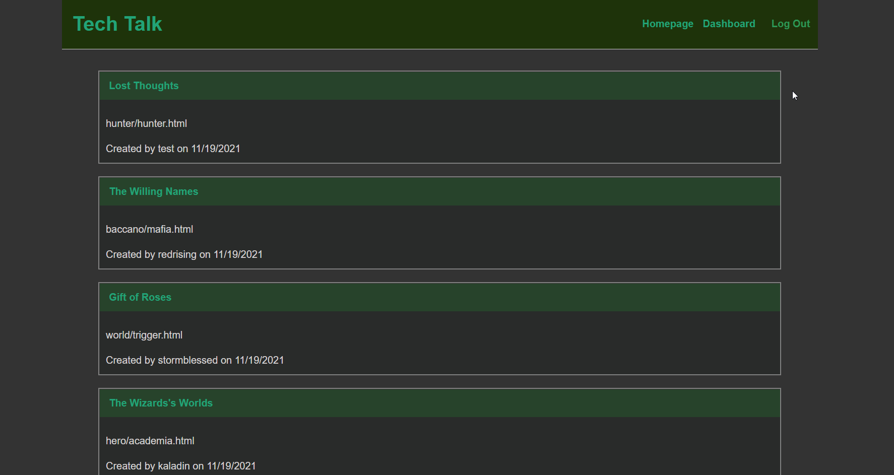

  # Tech Talk
    https://pacific-bastion-32337.herokuapp.com/

  ## Description
  This is a MVC CMS-style blog where developers can post and create comments on other users posts.

  ## Table of Contents
  * [Usage](#usage)
  * [Contributing](#contributing)
  

  ## Usage
  In root directory enter: 
```bash
  npm i
```
To add the database to MySQL:
```bash
  mysql -u root -p
    (enter your MySQL password)
  source db/schema.sql
  use blog_db
  show databases;
  quit
```
Add your seeds:
```bash
  npm run seed
```
To start server type: 
```bash
  npm start
```
  


  ## Contributing
  Stormblessed624
  

  ## Questions?
  - Reach me at my email: matt.white.624@gmail.com
  - GitHub username: [Stormblessed624](https://github.com/Stormblessed624/)

  
